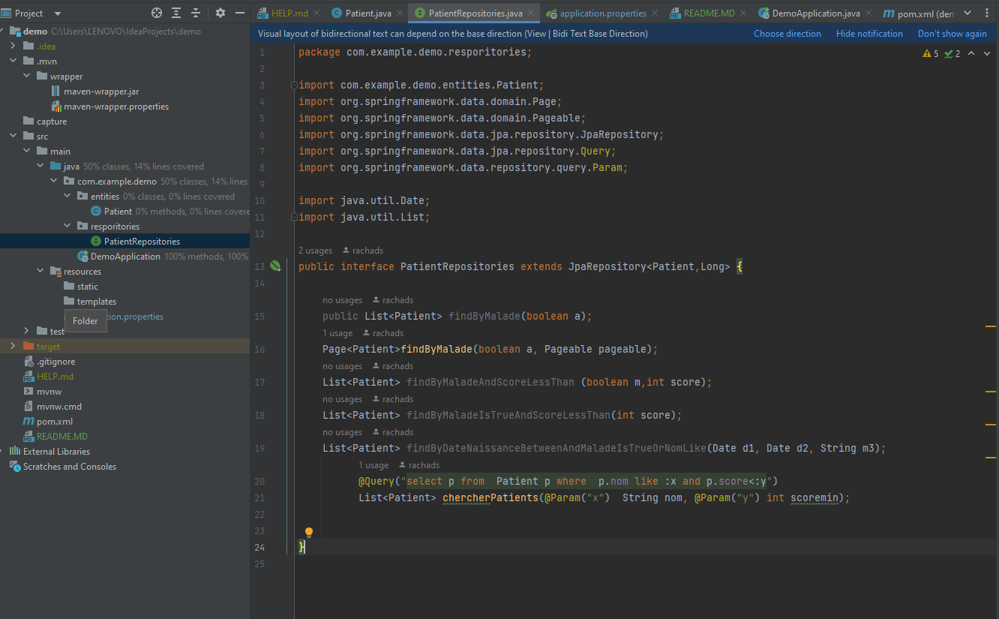
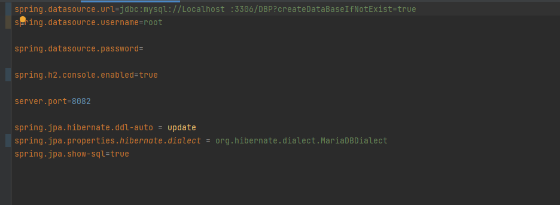

<h2>J2EE-TP2 / Spring Boot - ORM avec Spring Data JPA</h2>
<h3>1 . Classe Patient</h3>

<h3>2 . Configuration du ficher application.properties ( H2 DataBase )</h3>

<h3>3 . Démarrer h2database pour générer la base de données </h3>

<h3>4 . insertion des données </h3>
<h5 style="padding-left:30px;color:green"> 1. Inserssion</h5>

 
<h5 style="padding-left:30px;color:green"> 2. Affichage</h5>

<h3>5 . L'interface JpaRepository:  </h3>

<h3>6 . Filtrer les malades qui sont malades </h3>
<h5 style="padding-left:30px;color:green"> 1. Fonction</h5>

<h5 style="padding-left:30px;color:green"> 2. Affichage</h5>

<h3>7 . Basculer de h2database vers mySql </h3>

